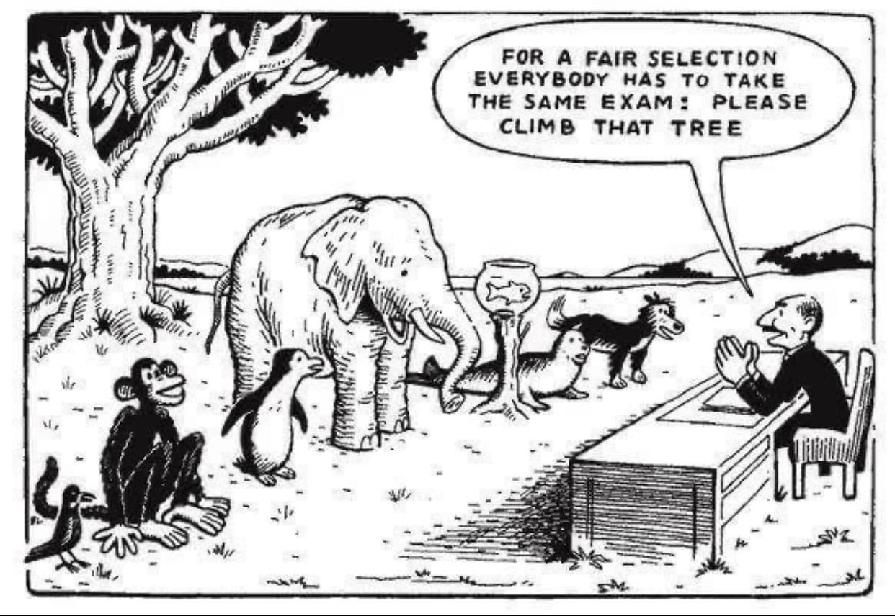

# Evaluation Methods

Language models are difficult to assess because they are so sensitive to changes in input. Small changes in prompting style give vastly different answers, which makes it hard to determine a model’s ‘ability’. Typically, tasks such as classification and summarization are easier to evaluate and score than sequence-to-sequence(that is, given an input sequence, output another sequence).

In most cases, models rely on use-case-specific evaluations that are not well suited to evaluating other models.

<figure><figcaption></figcaption></figure>
