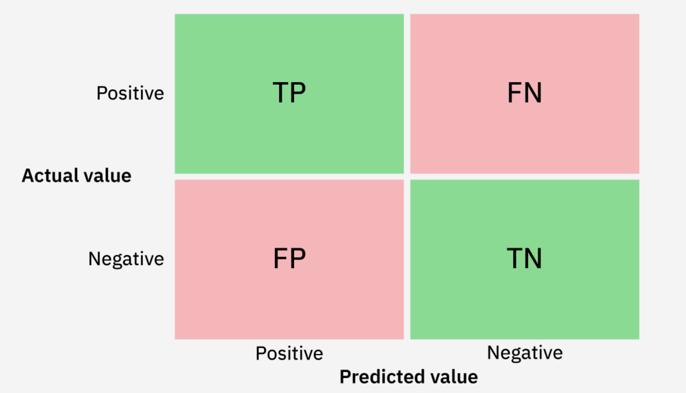

# Classification Metrics

### Precision, Accuracy, Recall and F1

These scores are based on the correct predictions by the classifier model. For example, sentiment classification into whether or not a statement is positive, negative or neutral. **TP** and **FN** here stand for True Positive, False Negative and **FP**, **TN** follows similarly.

<figure><figcaption></figcaption></figure>

<figure><figcaption></figcaption></figure>

Depending on the problem, some metrics may be prioritized over others.

Let's say your model classifies spam emails; a high false positive rate would mean your model is jumpy and flags certain non-spam emails as spam. You might lose important information if that email is never read, so **precision** is a good metric to go off of.

On the other hand, if you want to avoid false negatives (such as COVID-19 tests), **Recall** is a better metric to asses your model by because it takes to account the number of false negatives in the denominator.

These are not new concepts and are widely used outside the field of ML.
