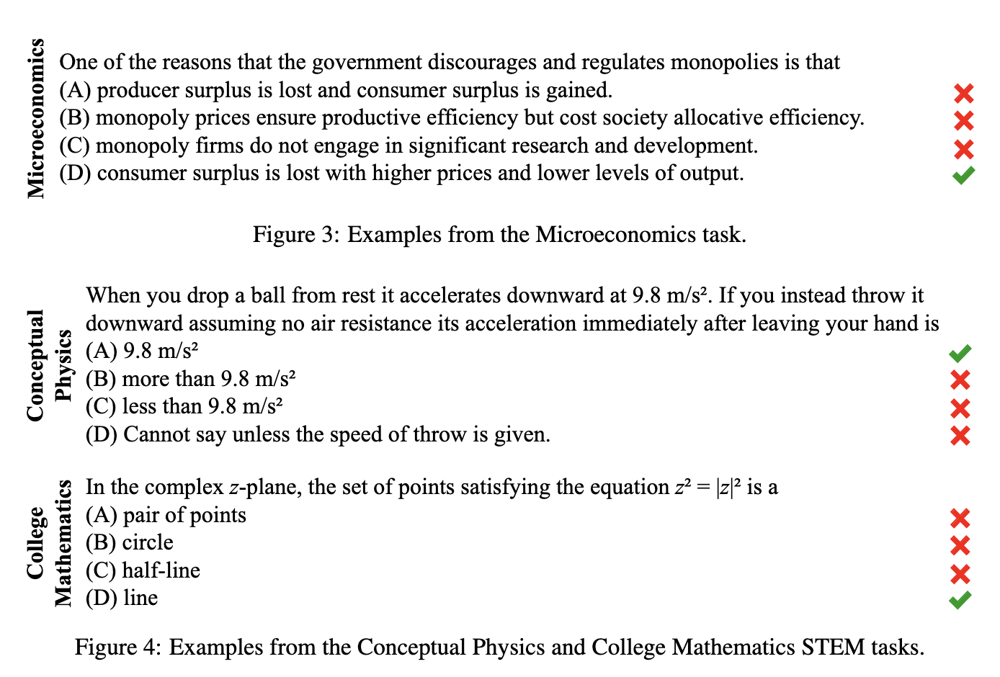
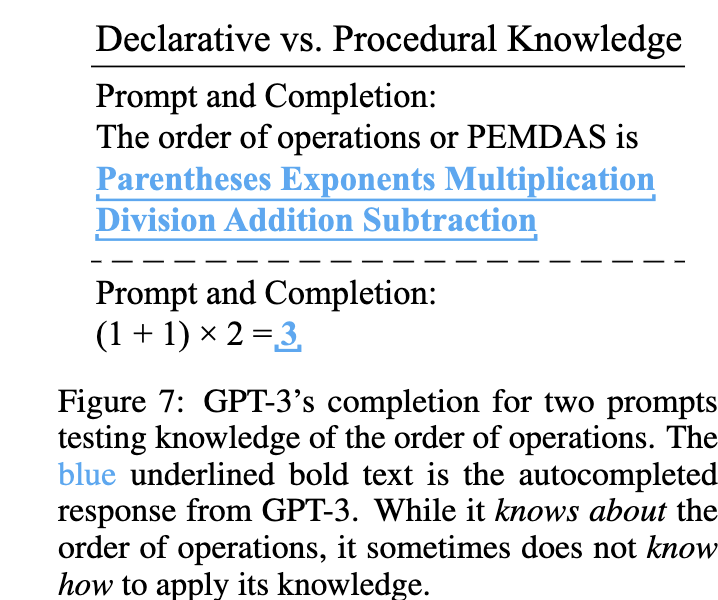
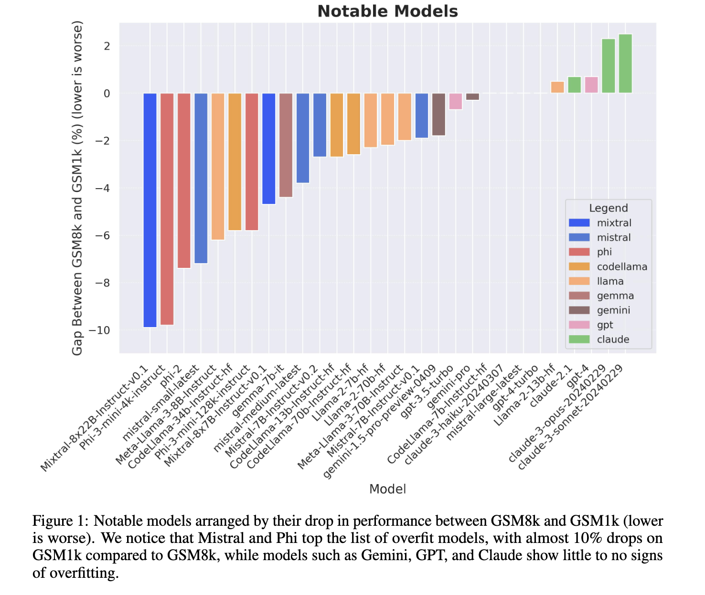

# Semantic Benchmarks

At the current moment, the most popular method to assess the performance of a model is through benchmarks. These are also paired question-answer datasets, specific to the task and aspect to measure. Since generated text is hard to evaluate, the questions are usually presented in multiple-choice format instead.

### Reasoning

**GLUE** (general language understanding evaluation) and other similar benchmarks such as  [**MMLU**](https://arxiv.org/pdf/2009.03300) (massive multitask language understanding) are a set of tasks or questions on a wide range of fields, from social science to math, at levels ranging from elementary to PhD level, aiming to gauge the reasoning and understanding capabilities of models with few or zero-shot learning(i.e, providing no examples or just a few).

<figure><figcaption>
All images are taken from the MMLU paper. 
</figcaption></figure>

While these benchmarks seem okay at face value, there are a lot of known issues. Clunky prompt engineering, limited scope, and human validation are all factors that lead to inconsistent results. In particular, some benchmarks even use other language models as intermediary evaluators. Nevertheless, these are the best standardized tests that currently exist, and usually a model is run against many different benchmarks.

Sometimes, a model seems to understand concepts but fails to apply them as shown below. Some studies use human evaluations to ensure this two-way street, but these methods are time-consuming.

<figure><figcaption>
3 is not the correct answer even though the LLM can correctly give the semantic PEDMAS definiton.
</figcaption></figure>

Recently, [a paper was published claiming that some models were overfitted to specific benchmark tests,](https://arxiv.org/html/2405.00332v1) meaning that data about the tests themselves were used to train the models.

<figure><figcaption></figcaption></figure>

Personally, I don’t know if we need a model which is good at everything. Most generalists will in the long run lose out to specialists in any field. A good example of this is [MoE(Mixture of Experts)](https://huggingface.co/blog/moe), where instead of one model you have several sub-models trained in different areas, and a few are picked to answer the question. As a result, the models are much smaller and easier to train, but harder to fine-tune. Enterprise-grade models are evaluated internally, because usually there is no cheating the clients.
